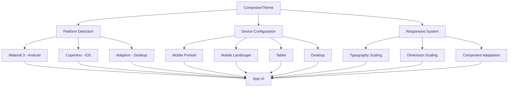

# Overview 🎯

Composive is a comprehensive library for building responsive and adaptive UIs in Compose Multiplatform applications. It provides a complete solution for creating interfaces that automatically adapt to different screen sizes, platforms, and orientations.

## What is Composive?

**Composive** = **Compose** + **Responsive** + **Adaptive**

Composive bridges the gap between different platforms by providing:

- 🔄 **Responsive design** that adapts to screen sizes
- 🎭 **Adaptive theming** for platform-specific look and feel
- 📱 **Device-aware components** that understand their context
- 🛠 **Developer-friendly APIs** with zero configuration setup

## Core Philosophy

### Write Once, Adapt Everywhere

```kotlin
@Composable
fun MyApp() {
    ComposiveTheme {
        // This automatically adapts to:
        // - Android with Material 3
        // - iOS with Cupertino
        // - Desktop with appropriate themes
        // - Different screen sizes and orientations
        ResponsiveLayout()
    }
}
```

### Platform-Smart Defaults

Composive automatically chooses the best theme for each platform:

=== "Android"

    ```kotlin
    // Automatically uses Material 3 theme
    // with Android-specific components
    ComposiveTheme {
        MaterialButton("Android Style")
    }
    ```

=== "iOS"

    ```kotlin
    // Automatically uses Cupertino theme
    // with iOS-specific components
    ComposiveTheme {
        CupertinoButton("iOS Style")
    }
    ```

=== "Desktop"

    ```kotlin
    // Uses platform-appropriate theme
    // optimized for desktop interactions
    ComposiveTheme {
        DesktopButton("Desktop Style")
    }
    ```

## Architecture Overview



## Key Components

### 1. Theme System
- **ComposiveTheme**: Main theme wrapper
- **ResponsiveConfiguration**: Customization DSL
- **Platform Detection**: Automatic platform identification

### 2. Responsive System
- **DeviceConfiguration**: Screen size and orientation detection
- **Responsive Dimensions**: Adaptive spacing and sizing
- **Typography Scaling**: Text that scales with screen size

### 3. Component Library
- **Adaptive Components**: Platform-aware UI elements
- **Layout Helpers**: Responsive layout utilities
- **Navigation Components**: Adaptive navigation patterns

## Benefits

### For Developers
- ✅ **Zero Configuration**: Works out of the box
- ✅ **Type Safety**: Fully typed APIs with IDE support
- ✅ **Hot Reload**: Instant feedback during development
- ✅ **Familiar APIs**: Uses standard Compose patterns

### For Users
- ✅ **Native Feel**: Each platform feels native
- ✅ **Consistent Experience**: Same functionality across platforms
- ✅ **Optimized Performance**: Platform-specific optimizations
- ✅ **Accessible**: Built with accessibility in mind

### For Teams
- ✅ **Shared Codebase**: Single codebase for all platforms
- ✅ **Maintainable**: Clear separation of concerns
- ✅ **Scalable**: Grows with your application
- ✅ **Testable**: Easy to test responsive behavior

## Next Steps

Ready to get started? Choose your path:

[Quick Start →](getting-started.md){ .md-button .md-button--primary }
[Installation Guide →](installation.md){ .md-button }
[View Examples →](examples.md){ .md-button } 